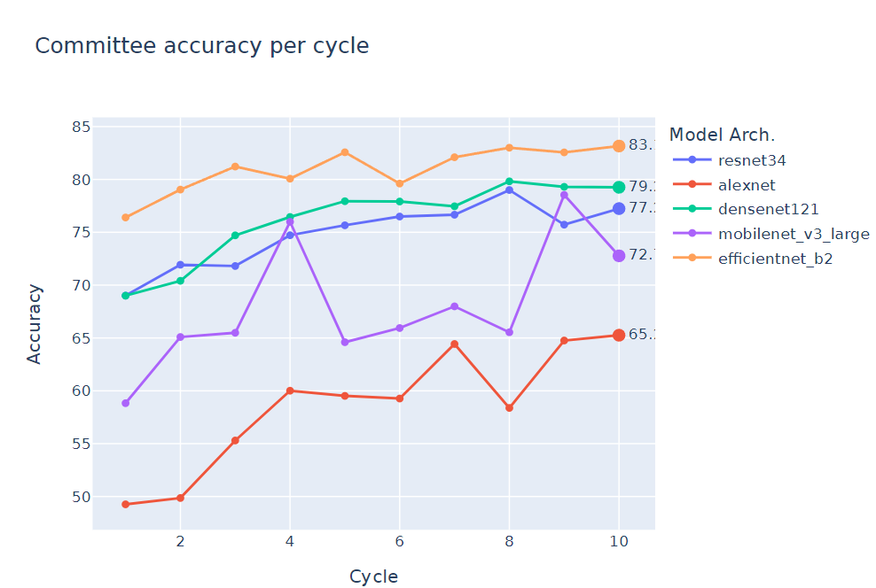

# AOT_WACV
Code for the paper "Army of Thieves: Enhancing Black-Box Model Extraction via Ensemble based sample selection"


```
conda env create -f environment.yml
```

## Steps to reproduce results:
### 1. Create environment using conda 

```
conda env create -f environment.yml
```
### 2. Create a configuration file in .yaml format. See sample configuration files in cfgs directory for more information.
```
E.g. For base experiment using consensus entropy for cifar10, use cfgs/cifar10/aot.yaml
```
### 3. Run the AOT attack to obtain the thief model ensemble. 
```
python aot.py --cfg=cfgs/cifar10/aot.yaml
```
### 4. Analyze the results using the same configuration file. 
```
python aot_analysis.py --cfg=cfgs/cifar10/aot.yaml
```
To use semi-supervised learning algorithm proposed in the paper, use aot_ssl_majvote.py (for CIFAR-10) and aot_ssl_fixmatch.py (for other datasets) with the same configuration file.<br>
Similarly for checking adversarial transferability, use the adv_transfer.py file with the same configuration file. Note that you need to run aot_analysis.py before doing this step. <br>
Finally you should obtain all the necessary models and statistics in the specified results directory. A sample graph is shown below.
</img>

